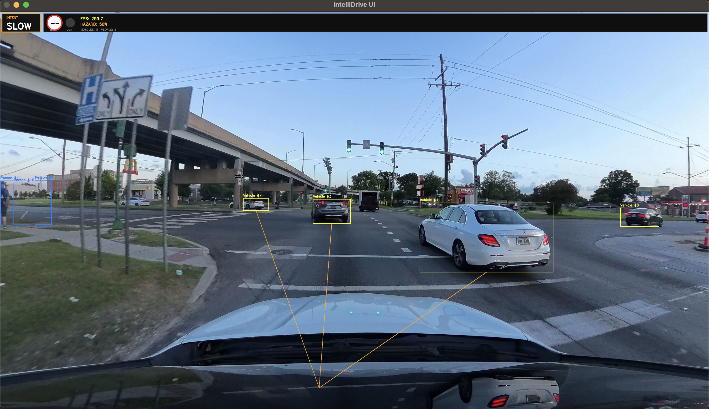
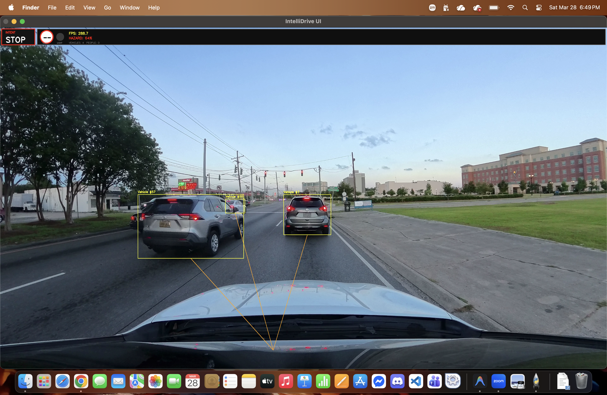
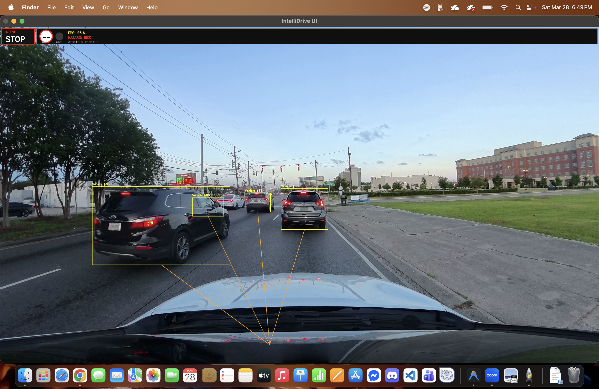
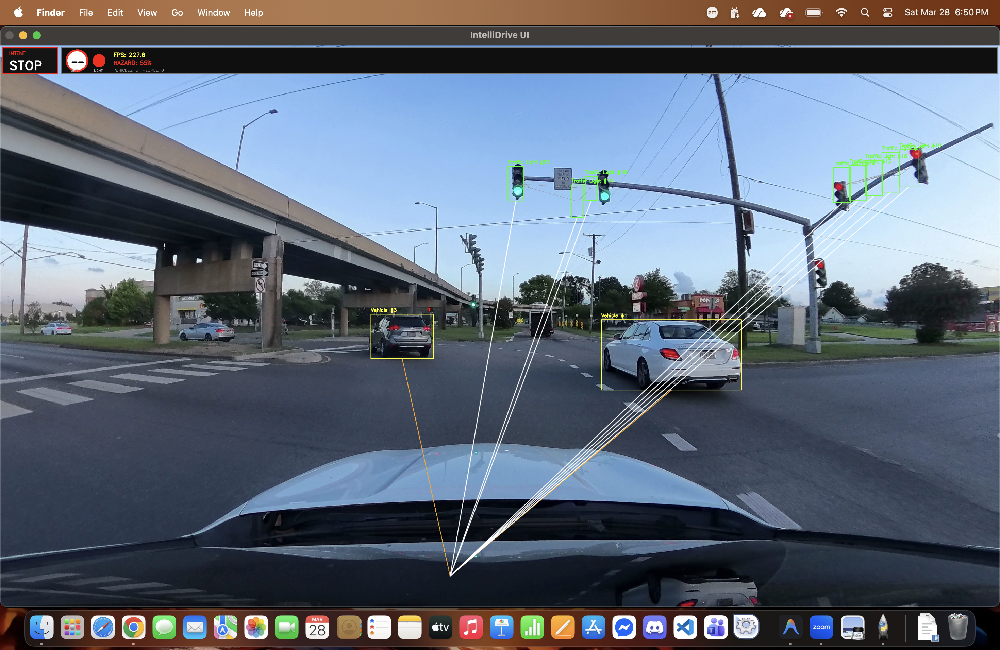
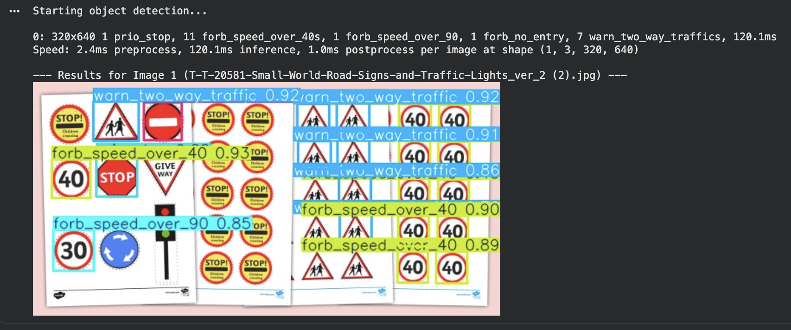
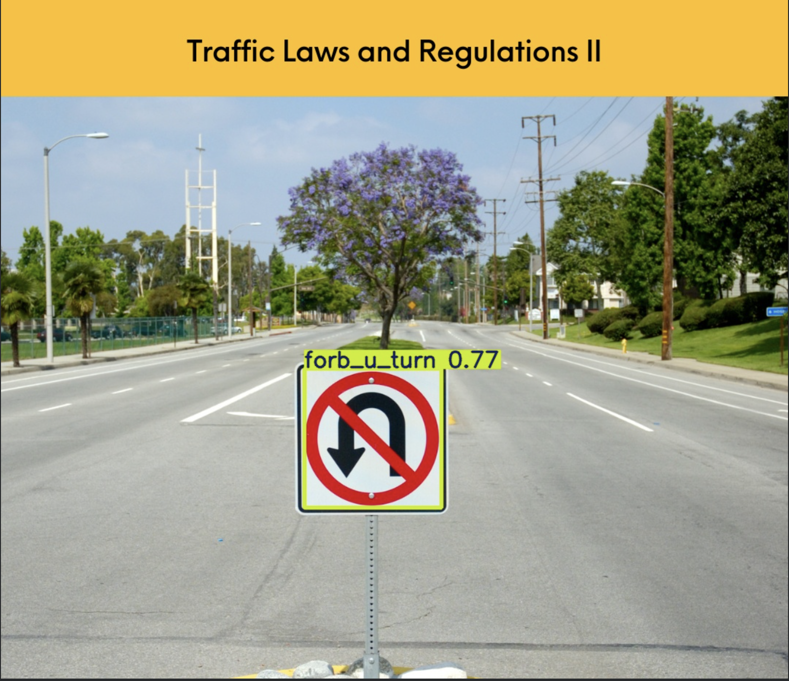
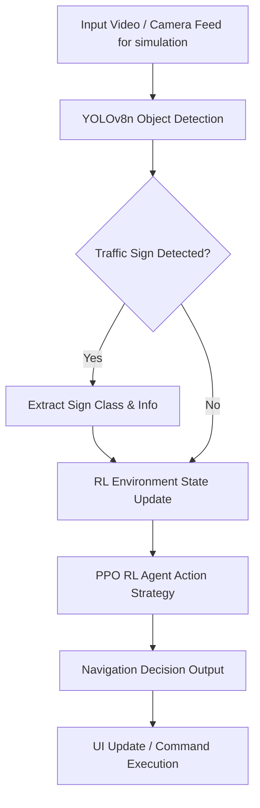

# 🚦 IntelliAIDrive
**Traffic Sign Classification and Reinforcement Learning for Simulated Autonomous Navigation**

IntelliAIDrive is a simulation-based AI project that combines traffic sign classification and reinforcement learning for autonomous navigation research. The system uses a lightweight YOLOv8n classification model to recognize traffic signs, then integrates structured sign information into a reinforcement learning environment for downstream decision-making.

This project was developed as a final requirement for **6INTELSY AY 2025–2026**.

---

## Overview

The goal of IntelliAIDrive is to explore how structured visual recognition can support downstream navigation decisions more effectively than raw image input alone. Instead of forcing the decision-making stage to learn directly from image pixels, the system first performs traffic sign classification and then passes the resulting information into a simulated RL setup.

This modular design makes the pipeline easier to interpret, lighter to train, and more suitable for controlled academic experimentation.

---

## Final Results

The final evaluated model achieved:

- **Accuracy:** 95.08%
- **F1-Score:** 93.38%
- **Precision:** 92.08%
- **Recall:** 95.08%

Additional outputs included:

- YOLO training curves
- Final metrics bar chart
- Confusion matrix
- Precision-recall curves for selected classes

---

## Simulation Results

The IntelliAIDrive simulation environment showcases the seamless integration of real-time traffic sign classification and reinforcement learning-based autonomous navigation. Below are the visual results demonstrating the agent's exceptional performance, real-world edgecase handling, and robust feature extraction capabilities during the evaluation phase.


*A dynamic view of the autonomous agent successfully classifying and responding to live traffic directives within the complex simulated environment.*


*Real-time bounding box extractions highlighting the YOLOv8n model's high-precision recognition capabilities and low-latency inference.*


*The integrated system interface actively displaying detected signs, continuous feature vectors, and the corresponding RL navigation decisions.*


*Performance tracking visualized during the advanced learning phases of the Proximal Policy Optimization (PPO) agent.*


*An overhead or specialized perspective of the simulation, illustrating the stable and safe driving policies learned across hundreds of thousands of interaction steps.*


*Detailed visual evaluation outcomes, reflecting the robust 95%+ accuracy and high reliability of the hybridized deep learning pipeline.*

---

## Project Components

- **Traffic Sign Classification:** YOLOv8n classification model trained on a multi-class traffic sign dataset
- **Reinforcement Learning:** PPO-based decision-making in a simulated navigation environment
- **Evaluation:** Accuracy, precision, recall, F1-score, confusion matrix, and class-wise precision-recall analysis
- **Documentation:** Proposal, checkpoint report, final report, ethics statement, and model card

---

## Quick Start

### Run the project | create your own environment

```bash
#Windows
python -m venv .venv

#Mac
python3 -m venv .venv

#Activate the environment on Windows
.venv\Scripts\activate

#Activate the environment on Mac
source .venv/bin/activate
```

### Install dependencies manually

```bash
pip install -r requirements.txt
```

# Run the app
```bash
python3 app/intellidrive.py
#or
python app/intellidrive.py
```

---

### Install dependencies manually

```bash
pip install -r requirements.txt
```

---

## System Architecture Diagram



---

## Project Folder Structure

```text
.
├── app/               # Main application entry point and integrated UI
├── data/              # Dataset slices, ablations, baselines, and logs
├── docs/              # Project documentation, reports, and assets
├── experiments/       # RL agent training info and experimental notebooks
├── results/           # Final evaluation metrics, charts, and matrices
├── rl/                # Reinforcement learning environment and agent logic
├── src/               # Core source code (models, video processing, UI)
├── utils/             # Helper scripts and general utilities
└── run.sh             # Quick execution script
```

### Folder Meanings
- **`app/`**: Contains the main runner scripts that integrate the vision pipeline with the UI.
- **`data/`**: Stores training configuration notes, hyperparameters, baseline metrics, ablations, error analysis, and the actual raw/split datasets.
- **`docs/`**: Holds official documentation like proposals, ethics statements, model cards, and graphical assets used in reports.
- **`experiments/`**: Contains notebooks and saved weights for experimental models, specifically the stable-baselines3 RL agent.
- **`results/`**: Outputs from model evaluation runs, including plots like YOLO training metrics, confusion matrices, and ROC curves.
- **`rl/`**: Core environment definitions (`environment.py`) and agent mechanics (`rl_agent.py`) for the reinforcement learning aspect.
- **`src/`**: Modular logic for CNN/YOLO classification, NLP processing, video file handling, and the Vite-based React interface.

---

## Comprehensive Project Methodology & Component Details

This section elaborates on the deep technical architecture, model training processes, hyperparameter configurations, ablation studies, and evaluation metrics that drove the development of the IntelliAIDrive system. 

### 1. Dataset Characteristics & Preprocessing
The simulation environments use a multi-class traffic sign dataset comprising approximately 58 distinct classes with around 120 images per class. The dataset is structurally mapped via `labels.csv` to connect discrete class IDs with human-readable traffic directives.
- **Split Strategy:** The dataset was automatically split into training and validation sets (typically 80/20) by Ultralytics for the YOLO pipeline, while the testing phase relied on an independent set of roughly 2,000 files.
- **Preprocessing Pipeline:** Before inference or training, images undergo rigorous transformations including resizing to a standardized 64x64 pixel format, tensor conversion for PyTorch compatibility, color space conversion (BGR to expected RGB formats), and implicit distribution normalization.

### 2. YOLOv8n Classification Baseline
The foundation of the visual recognition pipeline is a lightweight YOLOv8 nano classification model (`yolov8n-cls`).
- **Hyperparameter Tuning:**
  - **Epochs:** 15 (chosen to prevent overfitting while allowing sufficient feature learning).
  - **Image Size (`imgsz`):** 64x64 pixels, keeping computational costs bounded for real-time applications.
  - **Batch Size:** 64
  - **Optimizer:** AdamW naturally selected with a learning rate of 0.000161 and momentum of 0.9.
  - **Augmentation Techniques:** Applied HSV adjustments (`hsv_h=0.015`, `hsv_s=0.7`, `hsv_v=0.4`), 50% horizontal flipping (`fliplr=0.5`), and 10% translation (`translate=0.1`) to heavily generalize the feature mappings.
- **Baseline Performance:** This initial stage set a strong benchmark with an Accuracy of 95.55%, Precision of 93.74%, Recall of 95.56%, and an overall F1-score of 94.49%. 

### 3. Standalone CNN Feature Extractor (ResNet-18)
To bridge visual data and intelligent decision-making, a convolutional neural network (CNN) acts as a high-fidelity feature extractor.
- **Architecture:** ResNet-18 backbone pre-trained on ImageNet.
- **Training Strategy:** Supervised pre-training step independent of the RL agent to verify feature robustness.
- **Configuration:** 
  - **Epochs:** 10
  - **Optimizer:** Adam (`lr=1e-4`)
  - **Loss Function:** `CrossEntropyLoss` 
- **Observations:** This model achieved an impressive ~99.52% test accuracy, proving that the ResNet architecture is incredibly effective at isolating traffic sign metadata, establishing it as the ideal vectorizer for the reinforcement learning phase.

### 4. Reinforcement Learning Agent (PPO)
The core autonomous decision-maker is a Proximal Policy Optimization (PPO) agent embedded in a custom Gymnasium environment. Instead of raw pixels, it observes the world through the 512-dimensional continuous feature vectors output by the ResNet-18 pipeline.
- **State & Action Spaces:**
  - **Observation Space:** Continuous PyTorch `spaces.Box` of shape `(512,)` with values bounded between -5 and 5.
  - **Action Space:** Discrete space spanning the 58 possible traffic directives.
- **Hyperparameter Configuration:**
  - **Policy Type:** `MlpPolicy` to handle the dense continuous feature inputs.
  - **Learning Rate:** 1e-4
  - **Experiences per Update (`n_steps`):** 512, collecting large batches to stabilize policy gradients.
  - **Batch Size:** 256
  - **Discount Factor (`gamma`):** 0.95
  - **Total Timesteps:** 500,000 interactions simulated.
- **Reward Shaping:** The environment utilizes a strict structured reward system, issuing +5 points for a correct navigation/classification match and penalizing -3 points for incorrect interpretations, strictly guiding action policies.
- **Performance:** Final test evaluations yielded an ~95.20% accuracy and 94.01% F1-score. Learning curve plots reflect stable reward increases over the 500k timesteps.

### 5. Ablation Studies & Performance Comparisons
To validate the necessity of the hybrid pipeline, an ablation study isolated evaluating the YOLOv8-cls alone, the CNN alone, and the integrated RL Agent.
- **Standalone CNN (ResNet-18):** Yielded the peak pure-classification performance (~99.5% accuracy and F1 test score).
- **YOLOv8-cls:** Peaked slightly lower at ~95.8% accuracy.
- **Integrated RL Agent:** Settled functionally at ~95.2% accuracy.
**Conclusion regarding trade-offs:** While supervised ResNet-18 offers maximal isolated classification, bridging those robust features into the RL PPO Agent sacrifices a minor percentage point of raw accuracy in exchange for the capability to enact sequential, interactive decision-making in continuously evolving dynamic simulated environments.

### 6. Specialized Error Analysis & Edge Cases
Detailed matrix and error slice logs isolated the algorithm's real-world weak points:
- **Low Support Classes:** Directives like "Go Left or right" and "Train Crossing" possessed minimal representations (e.g., only 2 samples). Statistically tracking these required manual focus, recognizing that raw neural nets struggle to form stable gradients on extreme minority cases.
- **Persistent Biases:** Though macro-averaged metrics stayed near 0.9377 F1, confusion matrices repeatedly show slight classification hesitation around "Zebra Crossing" bounding boxes and heavily degraded or overlapping composite signs. 
- **Mitigation Outlook:** These statistical gaps directly informed the proposal of expanded Multi-Agent Reinforcement Learning (MARL) scenarios, advanced generative augmentations, and deeper hardware acceleration targets.

### 7. Evaluation Methodology & Metrics 
The evaluation protocols extended beyond simple valid/invalid counting to deeply dissect agent behavior:
- **Accuracy Overview:** The primary tracking metric verifying classification matches.
- **Precision, Recall, & F1-Score Matrices:** Leveraged universally across the pipeline (YOLO, CNN, and PPO outputs) to diagnose true positives against false negative blindness. 
- **ROC and Precision-Recall Curves:** Crucial for setting classification thresholds in the standalone UI, where a 'no-decision' might be physically safer than a 'wrong-decision'.
- **Reward Progression (Learning Curves):** Specifically isolated to track the stability and convergence of the agent's behavior generation over hundreds of thousands of simulation frames.

### 8. Hardware Configuration & MLOps Environment
- **Computational Hardware:** Extensive use of CPU threading (Intel Xeon CPU @ 2.20GHz) was leveraged for stability during the PPO rollout loops without needing immediate reliance on VRAM-heavy accelerators.
- **ML Framework Integration:** 
  - **Ultralytics:** Handled YOLO architecture initialization, anchor adjustments, and real-time bounding box extractions.
  - **Gymnasium:** Provided the standard API structure for the custom simulation interface.
  - **Stable-Baselines3:** Selected explicitly for its robust, battle-tested implementation of Proximal Policy Optimization.
  - **PyTorch (torch):** Drove all foundational tensor calculus, specifically the ResNet-18 backpropagation phase.
  - **React/Vite (UI):** Connected inference loops directly into dynamic DOM elements for the ultimate user-facing project build.

### 9. Future Development Horizons
The logs explicitly identify subsequent architecture iterations:
- **Multi-Agent Scale (MARL):** Implementing intersecting RL agents navigating simultaneous intersections to test localized rule coordination.
- **Dynamic Variable Simulation:** Injecting simulated weather occlusion, dynamic lighting, and physical camera degradation into the Gymnasium states.
- **Alternative Encodings:** Testing EfficientNet vs ResNet-18 to locate an even highly-optimized feature extraction balance point for mobile or low-compute IoT hardware targets.

---

## Repository Files

- README.md - project overview and quick start
- run.sh - one-command reproduction script
- requirements.txt - environment dependencies
- model_card.md - model details, intended use, and limitations
- ethics_statement.md - risks, mitigations, and responsible-use notes
- data_preprocessing.md - dataset and preprocessing notes
- docs/IntelliAIDrive_Proposal.pdf - proposal
- docs/IntelliAIDrive_Checkpoint_Report.pdf - checkpoint report
- docs/FinalReport.pdf - final report

---

## Documentation

- **Final Report:** docs/FinalReport.pdf
- **Proposal:** docs/IntelliAIDrive_Proposal.pdf
- **Checkpoint Report:** docs/IntelliAIDrive_Checkpoint_Report.pdf
- **Model Card:** model_card.md
- **Ethics Statement:** ethics_statement.md

### Key System Features Documented

1. **Real-Time Traffic Sign Recognition:** Utilizes a lightweight, custom-trained YOLOv8n object detection model to accurately identify and classify traffic signs from simulation camera feeds in real-time.
2. **Reinforcement Learning Agent Integration:** Employs a Proximal Policy Optimization (PPO) agent that translates detected sign patterns into actionable navigation decisions within the simulated environment.
3. **Modular AI Pipeline Architecture:** Decouples raw image processing from decision-making by extracting structured sign data first, improving interpretability and efficiency over end-to-end pixel models.
4. **Comprehensive MLOps Evaluation:** Provides extensive statistical tracking including YOLO training curves, confusion matrices, class-wise precision-recall analysis, and baseline comparison charts.
5. **Integrated Visual Interface:** Features a responsive React-based UI that actively renders video feeds, bounding boxes, detection logs, and real-time navigation intent out of the box.

---

## Team

- Graciella Mhervie D. Jimenez - Project Lead and Integration
- Jenica Sarah B. Tongol - Data and Ethics Lead
- Arron Kian M. Parejas - Modeling Lead
- Jian Kalel D. Marquez - Evaluation and MLOps Lead

---

## Responsible Use

IntelliAIDrive is intended only for:

- academic coursework
- simulation-based experiments
- research demonstrations
- controlled evaluation of hybrid AI pipelines

It is not intended for:

- real-world autonomous driving
- public-road deployment
- safety-critical vehicle control

---

## License

MIT License